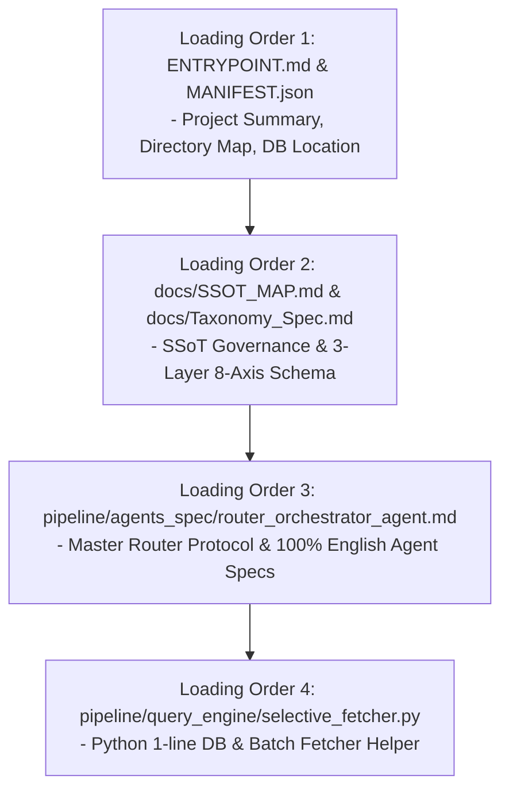

# Zero-Context AI Agent Infra Entrypoint Guide (ENTRYPOINT.md)

Welcome to the **CSAT Mathematics Zero-Context Agent Infrastructure** inside `kice-math-agent-infra/`.
This document is your **Loading Order 1 Entrypoint Guide**.

---

## 1. Quick Project Summary
- **Target Domain**: 2027 KICE Mock & CSAT Mathematics (Common: Algebra/Calculus I, Elective: Calculus II, Geometry, Prob & Stat).
- **Target User Personas**: Zero-Context Autonomous AI Agents & **Math Instructors / Professional Educators**.
- **Core Purpose**: End-to-end infrastructure allowing zero-context AI agents and Math Instructors to retrieve, reason, verify, and link math questions using the **3-Layer 8-Axis Taxonomy Architecture** (v2.8.0).
- **Dataset Scale**: **1,350 CSAT/KICE exam questions** across 45 PDF papers (2021~2026) and **1,350 high-res 300 DPI diagram PNG assets** loaded into a 4-Tier SQLite DB (`storage/parsed_dataset.db`).

---

## 2. Recommended Context Loading Protocol (Loading Order 1 ~ 4)



- **Loading Order 1 (This File & MANIFEST.json)**: High-level overview & entrypoints (v2.8.0).
- **Loading Order 2 ([docs/SSOT_MAP.md](docs/SSOT_MAP.md) & [docs/Taxonomy_Spec.md](docs/Taxonomy_Spec.md))**: SSoT Governance rules and Master 3-Layer 8-Axis Schema.
- **Loading Order 3 ([pipeline/agents_spec/router_orchestrator_agent.md](pipeline/agents_spec/router_orchestrator_agent.md))**: 100% English Master Router & 8 Axis Agent Specs.
- **Loading Order 4 ([pipeline/query_engine/selective_fetcher.py](pipeline/query_engine/selective_fetcher.py))**: High-performance batch fetcher helper (`get_questions_batch()`, latency $<10\text{ ms}$).

---

## 3. Directory Layout & Key File Map

```
kice-math-agent-infra/
├── PROJECT_STATE.json                  <-- System Status SSoT (Machine Readable State)
├── ENTRYPOINT.md                       <-- [You are here] Order 1 Entrypoint Guide (v2.8.0)
├── MANIFEST.json                       <-- Structured System Manifest (v2.8.0)
├── docs/                               <-- Master Specifications & Plans
│   ├── SSOT_MAP.md                     <-- Taxonomy & Domain SSoT Declarations
│   ├── STAKEHOLDER_INTENT.md           <-- Value SSoT for Educators & Agents
│   ├── Taxonomy_Spec.md                <-- Order 2: Master 3-Layer 8-Axis Schema
│   ├── Master_Blueprint.md             <-- System Architecture Roadmap
│   └── Backlog.md                      <-- Milestone & Task Planning
├── pipeline/                           <-- Source Code & Agent Specifications
│   ├── query_engine/                   <-- Order 4: Query Helpers
│   │   ├── selective_fetcher.py        <-- Batch & 8-Axis Selective Fetcher
│   │   └── routing_index.json          <-- Keyword to Routing Key Index
│   ├── agents_spec/                    <-- Order 3: Agent Prompts
│   │   ├── router_orchestrator_agent.md
│   │   ├── axis1_curriculum_agent.md
│   │   ├── ...
│   │   └── axis8_knowledge_graph_agent.md
│   └── migrate_db_8axis.py             <-- DB Migration Engine
├── storage/                            <-- 4-Tier Database & Assets
│   ├── parsed_dataset.db               <-- 1,350 Items SQLite DB (8 Flat Columns across 3 Layers)
│   ├── kice_math_concept_map.json      <-- Ground-Truth Math Concept Map Dataset
│   └── assets/                         <-- 1,350 High-Res Diagram PNGs
└── tests/                              <-- Automated Verification Test Suite
```

---

## 4. Quick 1-Line Python Query Snippet for Agents

```python
from pipeline.query_engine.selective_fetcher import QuestionFetcher

fetcher = QuestionFetcher()
# Fetch question item with selected axes in single batch query (<10ms)
data = fetcher.get_question('202411_MATH_DIF_22', axes=['Axis_1', 'Axis_3', 'Axis_4'])
print(data['item_id'], data['answer'], data['axes'])
```
