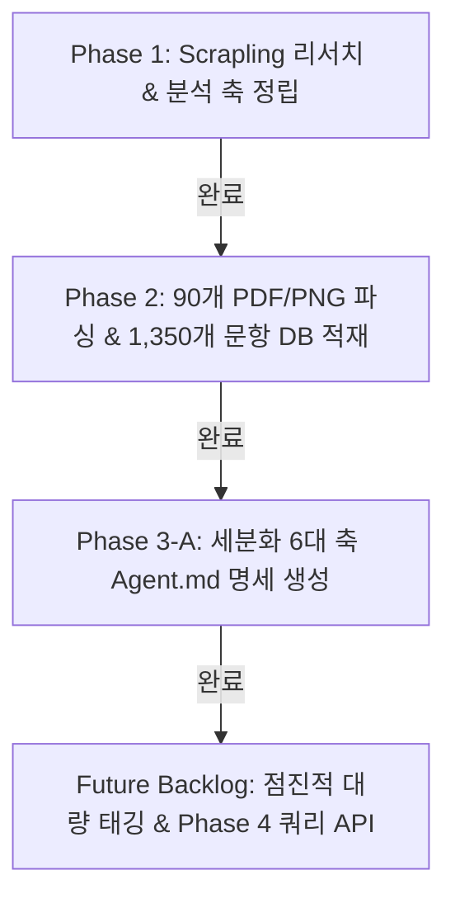

# 수능/평가원 수학 기출문항 분석 및 Zero-Context Agent Infra 구축 Master Blueprint

본 프로젝트는 최근 10년+ 수능 및 평가원 수학 기출문항(공통 및 미적분/기하/확률과통계)의 출제 의도, 조건 해독, 실전 풀이 스킬, 거시적 계통도 및 연도별 출제 흐름을 완벽히 구조화하여 **사전 맥락 없이(Zero-Context) 에이전트가 문항을 탐색·분석·추론할 수 있는 엔드투엔드 인프라**를 구축하는 것을 목표로 합니다.

---

## 1. 마일스톤 현황

---

## 2. 단계별 구축 세부 현황

### Phase 1: Scrapling 기반 리서치 & 다차원 분석 축 정립 (완료)
- **산출물**: [Taxonomy_Spec.md](file:///Taxonomy_Spec.md)

### Phase 2: 기출 90개 PDF/PNG 파싱 & 4-Tier Zero-Context DB 구축 (완료)
- **산출물**: [parsed_dataset.db](file:///c:/Users/packr/Claude/../pipeline/storage/parsed_dataset.db) (1,350개 문항 & 1,350개 고화질 도형 이미지 크롭 완료, 무결성 99.9%)

### Phase 3-A: 세분화 6대 축 `Agent.md` 및 Master Router 명세 구축 (완료)
- **위치**: [agents_spec/](file:///c:/Users/packr/Claude/../pipeline/agents_spec)
- **생성된 Agent.md 목록**:
  1. [axis1_concept_routing_agent.md](file:///c:/Users/packr/Claude/../pipeline/agents_spec/axis1_concept_routing_agent.md) (교과 개념 및 라우팅 인덱스)
  2. [axis2_condition_parsing_agent.md](file:///c:/Users/packr/Claude/../pipeline/agents_spec/axis2_condition_parsing_agent.md) (지문 조건 해독 수식 변환)
  3. [axis3_misconception_trap_agent.md](file:///c:/Users/packr/Claude/../pipeline/agents_spec/axis3_misconception_trap_agent.md) (오답 함정 및 오개념 유도)
  4. [axis4a_core_idea_lineage_agent.md](file:///c:/Users/packr/Claude/../pipeline/agents_spec/axis4a_core_idea_lineage_agent.md) (핵심 아이디어/유형 족보 세분화)
  5. [axis4b_condition_mutation_agent.md](file:///c:/Users/packr/Claude/../pipeline/agents_spec/axis4b_condition_mutation_agent.md) (지문 조건 표상 변형사 세분화)
  6. [axis5_target_2027_transformation_agent.md](file:///c:/Users/packr/Claude/../pipeline/agents_spec/axis5_target_2027_transformation_agent.md) (2027 6모 타겟 변형 예측)
  7. [router_orchestrator_agent.md](file:///c:/Users/packr/Claude/../pipeline/agents_spec/router_orchestrator_agent.md) (Master Router Orchestrator)

### Phase 3-B & Phase 4: 프로젝트 향후 백로그 (Future Backlog)
- **세부 계획 문서**: **[Backlog.md](file:///Backlog.md)**
- **백로그 항목**:
  - Item 1: 타겟 문항(2027 6모 & 최근 고난도) 우선 점진적 계통도 구축 및 대량 태깅 실행
  - Item 2: Zero-Context Agent 쿼리 API & Selective Fetching 엔진 구축
  - Item 3: 2027학년도 6월 평가원 기출문항 심층 분석 및 실전 시연

---

## Verification Plan

### Completed Verifications
- Scrapling 다각도 리서치 & 4대 Eval 검증 (점수 96.0/100)
- 45개 PDF/PNG 데이터셋 1,350개 문항 파싱 & 1,350개 도형 300 DPI 크롭 무결성 검증 (점수 99.9/100)
- 7대 `Agent.md` 에이전트 명세 구축 검증 완료
