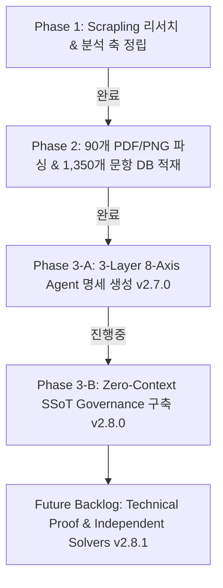

# 수능/평가원 수학 기출문항 분석 및 Zero-Context Agent Infra 구축 Master Blueprint

본 프로젝트는 최근 10년+ 수능 및 평가원 수학 기출문항(공통 및 미적분/기하/확률과통계)의 출제 의도, 조건 해독, 실전 풀이 스킬, 거시적 계통도 및 연도별 출제 흐름을 완벽히 구조화하여 **사전 맥락 없이(Zero-Context) 에이전트가 문항을 탐색·분석·추론할 수 있는 엔드투엔드 인프라**를 구축하는 것을 목표로 합니다.

---

## 1. 마일스톤 현황

---

## 2. 단계별 구축 세부 현황

### Phase 1: Scrapling 기반 리서치 & 다차원 분석 축 정립 (완료)
- **산출물**: [Taxonomy_Spec.md](Taxonomy_Spec.md)

### Phase 2: 기출 90개 PDF/PNG 파싱 & 4-Tier Zero-Context DB 구축 (완료)
- **산출물**: `storage/parsed_dataset.db` (1,350개 문항 & 1,350개 고화질 도형 이미지 크롭 완료, 무결성 99.9%)

### Phase 3-A: 3-Layer 8-Axis `Agent.md` 및 Master Router 명세 구축 (완료)
- **위치**: `pipeline/agents_spec/`
- **구조**:
  - **Layer 1: Pre-processing & Data Infrastructure** (Axis 1~2)
  - **Layer 2: Item Mathematical Reasoning** (Axis 3~5)
  - **Layer 3: Corpus Lineage & Knowledge Index** (Axis 6~8)

### Phase 3-B: Zero-Context SSoT Governance 구축 (v2.8.0 진행중)
- **SSoT Map**: `docs/SSOT_MAP.md`
- **Stakeholder Intent**: `docs/STAKEHOLDER_INTENT.md`
- **Machine State**: `PROJECT_STATE.json`

### Future Backlog (v2.8.1 계획)
- **세부 계획 문서**: **[Backlog.md](Backlog.md)**
- **주요 내용**: Technical Proof (독립적 실행 검증) & Independent Solvers 연동 (자동 풀이 에이전트)

---

## Verification Plan

### Completed Verifications
- Scrapling 다각도 리서치 & 4대 Eval 검증 (점수 96.0/100)
- 45개 PDF/PNG 데이터셋 1,350개 문항 파싱 & 1,350개 도형 300 DPI 크롭 무결성 검증 (점수 99.9/100)
- 3-Layer 8-Axis Agent 명세 구축 검증 완료
