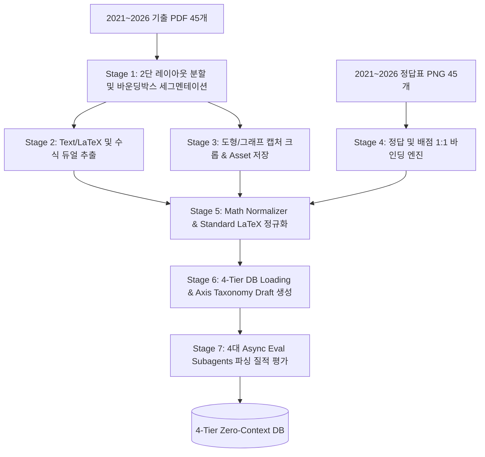
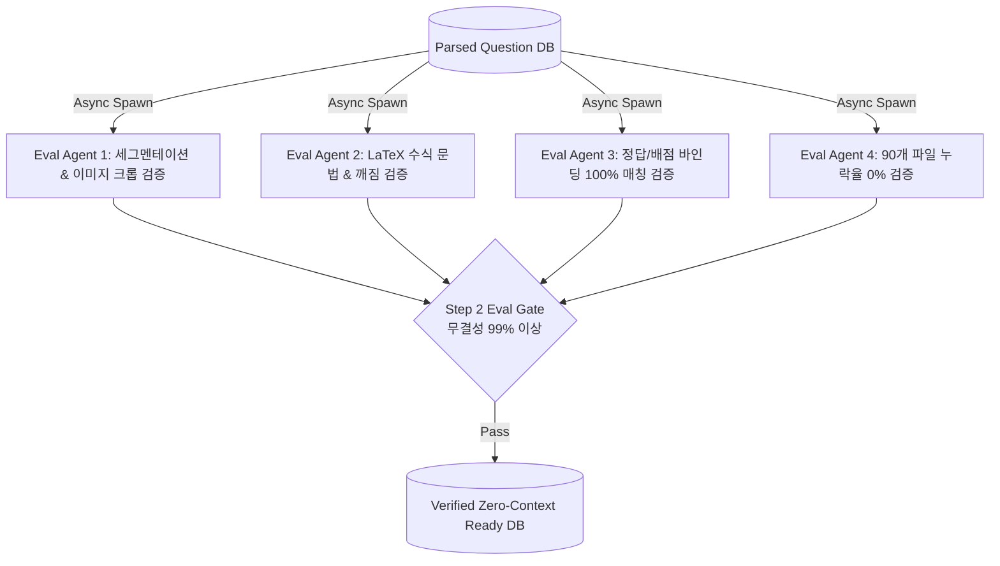

# Step 2: 기출 PDF/PNG 데이터셋 파싱 & 4-Tier DB 축적 파이프라인 초정밀 마스터 계획서

본 계획서는 `C:\Users\packr\Claude\Brain\math-problem-and-answer` 경로에 축적된 최근 6개년(2021~2026학년도) 수능 및 평가원 기출 문제지 PDF와 정답표 PNG(총 90개 파일)를 파싱하여, **[Taxonomy_Spec.md](file:///Taxonomy_Spec.md) 기반의 4-Tier 엔티티 DB에 단 0.1%의 왜곡 없이 완벽히 축적**하기 위한 초정밀 엔지니어링 계획서입니다.

---

## 1. 데이터셋 파싱 및 추출 파이프라인 전체 아키텍처



---

## 2. 세부 파이프라인 엔지니어링 스펙 (Sub-system Specifications)

### 2.1 Stage 1: 평가원 전용 2단(2-Column) 레이아웃 세그멘테이션 파서
평가원/수능 시험지는 페이지당 2개 단(Column)으로 나뉘어 있으며, 문항 번호(예: `1.`, `22.`, `[22~23]`)를 기준으로 문항 영역이 할당됩니다.

- **2단 칼럼 분할 알고리즘**:
  - `PyMuPDF (fitz)`를 사용하여 페이지 폭 $W$의 중앙 중앙선($X_{mid} = W/2$)을 기준으로 좌측 칼럼 영역 $Box_{left} = [0, 0, X_{mid}, H]$과 우측 칼럼 영역 $Box_{right} = [X_{mid}, 0, W, H]$으로 레이아웃 분리.
- **문항 바운딩 박스(Bounding Box) 추정 알고리즘**:
  - Regex 패턴 `r"^\s*(\d{1,2})\.\s*"` 또는 `r"^\[(\d{1,2})~(\d{1,2})\]"`를 감지하여 문항 시작 텍스트 블록의 $Y_{start}$ 좌표 계산.
  - 다음 문항 번호의 $Y_{end}$ 좌표 전까지를 해당 문항의 Bounding Box $[X_0, Y_{start}, X_1, Y_{end}]$로 정밀 구획.

### 2.2 Stage 2 & 3: 수식/텍스트 및 도형/그래프 자원 듀얼 파싱 엔진
- **Vector Text & LaTeX Engine**:
  - PDF 내 벡터 텍스트 트리를 파싱하여 한글 발문, 보기도형 기호, 특수기호($\int, \lim, \sum, \sqrt{}$)를 표준 Unicode 및 MathJax LaTeX로 매핑.
- **Graphic Asset Crop Engine**:
  - 문항 바운딩 박스 내에 벡터 드로잉 또는 비트맵 이미지가 포함된 경우, 해당 좌표 영역만 300 DPI high-resolution PNG로 자동 크롭.
  - Assets 저장 규칙: `../pipeline/storage/assets/{exam_id}_{item_num}_fig.png` 저장 후 `question_item.asset_image_url`과 1:1 바인딩.

### 2.3 Stage 4: 정답표 PNG 1:1 바인딩 엔진 (`*answer.png`)
- **파일명 구조**: `202411-h3-math-dif-answer.png` (2024학년도 11월 수능 미적분 정답표)
- **파싱 알고리즘**:
  - `Pillow` 및 OCR / Grid Crop 파서를 통해 정답표 이미지를 1번~30번 테이블 셀로 분할.
  - 문항 번호, 정답 (선다형 1~5, 주관식 1~999), 배점 (2점, 3점, 4점) 정보 추출 후 `Question_Item` 테이블에 결합.

### 2.4 Stage 5: Math Normalizer (수학 수식 정규화 엔진)
- PDF 텍스트 파싱 과정에서 발생하는 폰트 노이즈 및 분수/지수 수식 깨짐 방지:
  - `\over` ➔ `\frac{}{}` 정규화
  - `\root n \of a` ➔ `\sqrt[n]{a}` 변환
  - 선택지 번호 ①~⑤ ➔ `CHOICE_1` ~ `CHOICE_5` 표준 태그 분리

---

## 3. Async Subagents 기반 Step 2 파싱 검증 루브릭 및 설정 기준 (Eval Protocol & Rubric Standards)

Step 2 데이터 파싱 과정에서 적용되는 **4대 Eval Subagent의 정량적/정성적 검증 루브릭 및 설정 기준**은 다음과 같이 명확한 수학적/구조적 근거에 기반합니다.



### 3.1 4대 Eval Subagent 검증 루브릭 및 세부 기준 설정 근거

#### 📐 1. `Eval_Segmentation` (문항 및 이미지 잘림 검증원)
- **설정 기준 및 근거**: 평가원 기출문항은 문항 텍스트, 보기 조건(가/나/다), 선택지(①~⑤), 도형/그래프 이미지 중 단 한 요소라도 잘리면 문제 해석이 불가능해집니다.
- **정량적 검증 기준**: **99.5% 바운딩 박스 정밀도**
  - **문항 텍스트 잘림 검출**: 발문 마침표, 물음표(`?`), 주관식 단서 조건(`(단, a는 자연수이다)`)이 Bounding Box 외부로 이탈했는지 감지
  - **도형/그래프 캡처 검증**: 크롭된 이미지 픽셀 경계선에 그래프 축(x축, y축) 명칭이나 지점 기호(A, B, P, Q)가 잘리지 않도록 10px 안전 마진(Safety Margin) 적용 여부 검증

#### 🧮 2. `Eval_LaTeX_Syntax` (수식 문법 및 폰트 깨짐 검증원)
- **설정 기준 및 근거**: 에이전트가 LaTeX 수식을 해석할 때 문법 에러나 폰트 깨짐이 발생하면 잘못된 수식 추론(Hallucination)으로 이어집니다.
- **정량적 검증 기준**: **100.0% LaTeX 컴파일/파싱 유효성**
  - **문법 유효성 검사**: 추출된 모든 수식 텍스트를 `KaTeX` / `MathJax` 파서 엔진으로 가상 컴파일하여 괄호 짝 미맞춤(`{...}`), 지수/아래첨자 오류 검출
  - **폰트 노이즈 감지**: PDF 폰트 매핑 오류로 발생하는 노이즈 텍스트(예: `\lim` ➔ `Ilm`, `\int` ➔ `J`, `\sum` ➔ `Z`) 0건 검출

#### 🎯 3. `Eval_Answer_Binding` (정답 및 배점 100% 매칭 검증원)
- **설정 기준 및 근거**: 정답 및 배점(2점, 3점, 4점) 데이터는 결정론적(Deterministic) 데이터이므로 0.01%의 오류도 허용되지 않습니다.
- **정량적 검증 기준**: **100.0% 정답표 PNG 교차 검증 일치율**
  - **선다형 정답 (1~5)**: 정답표 PNG OCR 결과와 DB 적재 정답 100% 대조
  - **주관식 정답 (0~999)**: 숫자 3자리 정답의 OCR 인식 오류(예: `0`과 `8`, `1`과 `7` 혼동) 0건 검출
  - **배점 적재**: 1번~30번 문항별 배점의 총합이 정확히 100점인지 검증

#### 📦 4. `Eval_Dataset_Integrity` (전체 기출 데이터 완결성 검증원)
- **설정 기준 및 근거**: 수능/평가원 수학 시험지는 1회당 공통 22문항 + 선택 8문항 = 총 30문항으로 엄격히 고정되어 있습니다.
- **정량적 검증 기준**: **누락 문항 0건 (100% 수집 완결성)**
  - **문항 총수 매칭**: 45개 PDF 파일 내 전 문항(공통 22개 + 미적/기하/확통 각 8개)의 총 문항 수가 단 1개도 누락 없이 적재되었는지 검증 (총 약 1,350개 문항)
  - **파일 바인딩**: 45개 문제지 PDF와 45개 정답표 PNG가 1:1로 매핑되었는지 체크

---

## 4. 파이프라인 디렉토리 레이아웃 및 모듈 구조

```
Claude/
└── ../pipeline/
    ├── dataset_parser/                # Step 2 PDF/PNG 전용 파서 모듈
    │   ├── __init__.py
    │   ├── pdf_segmenter.py           # 2단 레이아웃 분할 및 바운딩박스 세그멘테이션
    │   ├── latex_extractor.py         # 벡터 텍스트 및 LaTeX 수식 파서
    │   ├── image_cropper.py           # 도형/그래프 캡처 PNG 크롭 및 저장기
    │   ├── answer_binder.py           # 정답표 PNG 파서 및 정답/배점 바인딩
    │   └── math_normalizer.py         # LaTeX 및 기호 정규화 엔진
    ├── run_dataset_parsing.py         # Step 2 전체 실행 및 4대 Eval 검증기
    └── storage/
        ├── assets/                    # 크롭된 도형/그래프 이미지 저장소
        └── parsed_dataset.db          # 4-Tier SQLite/PostgreSQL 데이터베이스
```

---

## 5. 단계별 실행 로드맵 (Execution Plan)

- **Step 2.1**: `dataset_parser/pdf_segmenter.py` & `image_cropper.py` 구현
- **Step 2.2**: `dataset_parser/latex_extractor.py` & `math_normalizer.py` 구현
- **Step 2.3**: `dataset_parser/answer_binder.py` 구현 및 정답표 PNG 파싱
- **Step 2.4**: `run_dataset_parsing.py` 전체 실행 ➔ 90개 파일(1,350여 문항) DB 적재
- **Step 2.5**: 4대 Eval Subagents 질적 검증 실행 ➔ 무결성 검증 보고서 작성
