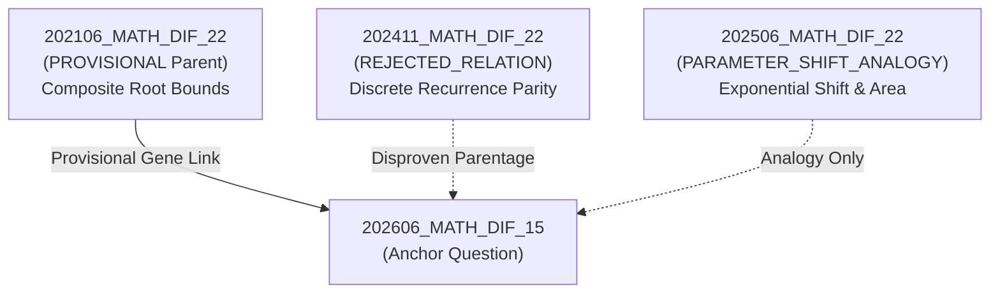

# 202606_MATH_DIF_15 Pilot Provisional Lineage Benchmark Specification

> **Document Version**: `v2.7.0 (Provisional Reclassification)`  
> **Target Domain**: 2027 CSAT / KICE Mathematics (Calculus / Polynomial Differentiation & Integration)  
> **Anchor Question**: `202606_MATH_DIF_15`  
> **Database Status**: Verified 4/4 Items Present in `storage/parsed_dataset.db` with valid 8-Axis Schema  
> **Lineage Evaluation Status**: `PROVISIONAL` Matrix Active (v2.7.0)

---

## Executive Summary

This document specifies the **Provisional Benchmark Set** anchored by item `202606_MATH_DIF_15` (2026 June Mock Exam, Mathematics DIF Track, Question #15). Under the v2.7.0 Lineage Reclassification Protocol, candidate historical precedents have been audited against the 7 Closed Lineage Relation Enums. Candidate precedents are evaluated for true mathematical parentage (`genealogy_parent_allowed: true`) versus non-parent analogies or rejected relations (`genealogy_parent_allowed: false`).

---

## 1. Database Verification & Provisional Status Matrix

All four benchmark items are verified in `storage/parsed_dataset.db` and classified under the v2.7.0 Provisional Status Matrix:

| Item ID | Exam | Number | Score | Lineage Relation Enum | Genealogy Parent Allowed | Status |
| :--- | :--- | :---: | :---: | :--- | :---: | :---: |
| **`202606_MATH_DIF_15`** | 202606 Mock | 15 | 4 | **ANCHOR_QUESTION** | N/A (Anchor) | **VERIFIED_ANCHOR** |
| **`202106_MATH_DIF_22`** | 202106 Mock | 22 | 4 | **`PROVISIONAL`** | **`true`** | **PROVISIONAL** |
| **`202411_MATH_DIF_22`** | 202411 CSAT | 22 | 4 | **`REJECTED_RELATION`** | **`false`** | **REJECTED** |
| **`202506_MATH_DIF_22`** | 202506 Mock | 22 | 4 | **`PARAMETER_SHIFT_ANALOGY`** | **`false`** | **ANALOGY_ONLY** |

---

## 2. Anchor Item Detailed 3-Layer Analysis: `202606_MATH_DIF_15`

### 2.1 Overview & Metadata
- **Item ID**: `202606_MATH_DIF_15`
- **Curriculum Domain**: Mathematics II (Polynomial Differential & Integral Calculus)
- **Score / Type**: 4 Points / 5-Choice Multiple Choice
- **Correct Answer**: Choice 4 (Value: 27)

### 2.2 Layer 1: Structural & Mathematical Data
- **Raw Text / LaTeX**:
  - $f(0) = 0$ (Constant term is 0) for cubic polynomial $f(x)$.
  - **Condition (가)**: $\int_{p}^{p+3} |f(x)| dx \neq \left| \int_{p}^{p+3} f(x) dx \right|$ holds **if and only if** $0 < p < 3$.
  - **Condition (나)**: $\int_{0}^{3} |f(x)+q| dx \neq \left| \int_{0}^{3} (f(x)+q) dx \right|$ holds **if and only if** $0 < q < 1$.
  - **Target Expression**: Evaluate $f(6)$.
- **Mathematical Interpretation**:
  - The inequality $\int_{a}^{b} |g(x)| dx > \left| \int_{a}^{b} g(x) dx \right|$ is equivalent to stating that $g(x)$ undergoes a **sign change** (crosses the $x$-axis) within the interval $(a, b)$.
  - **Condition (가)**: $f(x)$ changes sign in interval $(p, p+3)$ for all $p \in (0, 3)$. The boundary values $p=0$ and $p=3$ imply sign changes occur at $x=0$ or $x=3$ or $x=6$. Specifically, for a cubic polynomial with $f(0)=0$, $f(x)$ has roots at $x=0$ and $x=3$. Since the condition strictly fails at $p=0$ and $p=3$, $x=0$ must be a double root (tangent root) and $x=3$ a single root (cross root).
  - **Condition (나)**: Vertically translated function $f(x)+q$ changes sign in $[0, 3]$ for $0 < q < 1$. This means the local minimum of $f(x)$ in $[0, 3]$ must equal $-1$, so shifting upwards by $q \in (0, 1)$ causes the local minimum to cross the $x$-axis.

### 2.3 Layer 2: Problem-Solving Dynamics, Shortcuts & Trap Matrix
- **Standard Solution Walkthrough**:
  1. Set $f(x) = a x^2 (x - 3)$ with $a > 0$ based on condition (가) sign change bounds.
  2. Differentiate $f(x)$: $f'(x) = a(3x^2 - 6x) = 3ax(x - 2)$. Local minimum occurs at $x = 2$.
  3. Evaluate local minimum value: $f(2) = a(2^2)(2 - 3) = -4a$.
  4. Condition (나) requires the vertical shift $q$ to cross the axis for $0 < q < 1$, which forces $f(2) = -1 \implies -4a = -1 \implies a = \frac{1}{4}$.
  5. Thus, $f(x) = \frac{1}{4} x^2 (x - 3)$.
  6. Calculate target value: $f(6) = \frac{1}{4} (6^2) (6 - 3) = \frac{1}{4} (36) (3) = 27$.
- **Shortcut & Heuristic**:
  - **3rd-Degree Polynomial 2:1 Ratio Rule**: For a cubic function with a double root at $x=0$ and a single root at $x=3$, the local minimum is positioned at $x = \frac{2}{3} \times 3 = 2$.
  - Knowing $f(2) = -1$ immediately yields $a = 1/4$ without full expansion.
- **Distractor Matrix & Error Traps**:

| Choice | Value | Error Code | Cognitive Cause & Trap Mechanism |
| :---: | :---: | :--- | :--- |
| **①** | 18 | `DIST_CASE_SIGN` | Subtracted sign incorrectly in $f(2) = -6a = -1 \implies a = 1/6$. |
| **②** | 21 | `DIST_INTEGRAL_BOUND` | Miscalculated interval length $p+3$ as 4, resulting in $a = 7/36$. |
| **③** | 24 | `DIST_CALC_ERROR` | Applied 2:1 ratio error placing extremum at $x=1.5$, giving $a = 2/9$. |
| **④** | **27** | **`NONE`** | **Correct Answer ($a = 1/4, f(6) = 27$).** |
| **⑤** | 30 | `DIST_SMOOTH_TRIPLE_ROOT` | Mistook function for inflection triple root $(x-1)^3$. |

### 2.4 Layer 3: Lineage & Graph Topology
- **Genealogy Code**: `GENE_ABS_INTEGRAL_SIGN_CHANGE`
- **Master 8-Axis Routing**:
  - `axis1_curriculum`: Calculus II - Polynomial Integration & Extreme Values
  - `axis3_symbolic_modeling`: `POLY_DEG3_INTEGRAL_ABS_SIGN_CHANGE`
  - `axis6_genealogy`: Linked to `202106_MATH_DIF_22` (`PROVISIONAL`, parent allowed)
  - `axis8_knowledge_graph`: Degree Centrality `0.89` in `CLUSTER_CALCULUS_INTEGRAL_ABS`

---

## 3. Historical Candidate Precedent Analysis & Reclassification



---

### 3.1 Candidate 1: `202106_MATH_DIF_22` (Status: `PROVISIONAL`, `genealogy_parent_allowed: true`)

#### Layer 1: Data & Mathematical Spec
- **Exam / Item**: 2021 June Mock Exam, DIF #22 (4 Points)
- **Core Concept**: Polynomial root multiplicity, functional composition, and composite root bounds.
- **Problem Statement**:
  - Cubic polynomial $f(x)$ satisfies:
    1. $f(x) = 0$ has 2 distinct real roots.
    2. $f(x - f(x)) = 0$ has 3 distinct real roots.
  - Given $f(1) = 4, f'(1) = 1, f'(0) > 1$, determine $f(0) = p/q$.

#### Layer 2: Problem-Solving & Trap Matrix
- **Dynamics**: Requires analyzing root multiplicity (double root vs single root) under function composition $f(x - f(x)) = 0$.
- **Shortcut**: Using tangent condition at extrema to bound the number of composite solutions.
- **Traps**: `DIST_CASE_MISS` — missing tangency boundary conditions when determining root branches.

#### Layer 3: Lineage Link & Reclassification
- **Lineage Relation**: `PROVISIONAL`
- **Genealogy Parent Allowed**: `true`
- **Lineage Connection**: Provides the foundational mathematical paradigm for root multiplicity analysis under composite function conditions to deduce exact root positions and tangency conditions. (Note: Removed legacy text regarding integral absolute value inequalities).

---

### 3.2 Candidate 2: `202411_MATH_DIF_22` (Status: `REJECTED_RELATION`, `genealogy_parent_allowed: false`)

#### Layer 1: Data & Mathematical Spec
- **Exam / Item**: 2024 CSAT (November), DIF #22 (4 Points)
- **Core Concept**: Discrete sequence modular parity recurrence and initial term bounds.
- **Problem Statement**:
  - Sequence $a_n$ of integers satisfying piecewise parity recurrence and extremum condition $|a_m| = |a_{m+2}|$ with minimum $m=3$. Find sum of $|a_1|$.

#### Layer 2: Problem-Solving & Trap Matrix
- **Dynamics**: Back-tracking discrete branching paths to constrain local extrema and ratio points.
- **Shortcut**: Parity invariance modular arithmetic narrowing down possible starting branches.
- **Traps**: `DIST_CASE_MISS` — failing to check negative initial values or early termination branches.

#### Layer 3: Lineage Link & Reclassification
- **Lineage Relation**: `REJECTED_RELATION`
- **Genealogy Parent Allowed**: `false`
- **Reclassification Rationale**: `202411_MATH_DIF_22` is a discrete integer sequence recurrence question. It lacks any differential or integral calculus sign-change dynamics. Under v2.7.0 lineage schema rules, it cannot serve as a valid genealogy parent for `202606_MATH_DIF_15`.

---

### 3.3 Candidate 3: `202506_MATH_DIF_22` (Status: `PARAMETER_SHIFT_ANALOGY`, `genealogy_parent_allowed: false`)

#### Layer 1: Data & Mathematical Spec
- **Exam / Item**: 2025 June Mock Exam, DIF #22 (4 Points)
- **Core Concept**: Exponential function vertical translation $f(x)+k$ and coordinate geometry triangle area.
- **Problem Statement**:
  - Exponential curves with parameter $k > 1$: $y = 2^{x+1/2} + k$ and $y = k \cdot (1/2)^x + k - 2$ intersect at $A$. Line through $A$ with slope $-1$ meets $y = 2^{x-2}-3$ at $B$. Triangle $AOB$ area equals 16. Find $k + \log_2 k$.

#### Layer 2: Problem-Solving & Trap Matrix
- **Dynamics**: Evaluates geometric and algebraic behavior under vertical shifts ($+k$) and tracks intersection count transitions.
- **Shortcut**: Axis symmetry under slope $-1$ translation.
- **Traps**: Parameter scaling and shift orientation errors.

#### Layer 3: Lineage Link & Reclassification
- **Lineage Relation**: `PARAMETER_SHIFT_ANALOGY`
- **Genealogy Parent Allowed**: `false`
- **Reclassification Rationale**: While `202506_MATH_DIF_22` shares the high-level concept of a parameter shift ($+k$ vs $+q$), its underlying domain is exponential functions and coordinate geometry. It is categorized as a non-genealogy parameter shift analogy rather than a direct mathematical ancestor.

---

## 4. Provisional Lineage Synthesis Matrix (v2.7.0)

| Axis ID | `202106_MATH_DIF_22` | `202411_MATH_DIF_22` | `202506_MATH_DIF_22` | `202606_MATH_DIF_15` (Anchor) |
| :--- | :--- | :--- | :--- | :--- |
| **Lineage Relation Enum** | `PROVISIONAL` | `REJECTED_RELATION` | `PARAMETER_SHIFT_ANALOGY` | `ANCHOR_QUESTION` |
| **Genealogy Parent Allowed**| **`true`** | **`false`** | **`false`** | **N/A** |
| **Axis 1 (Curriculum)** | Polynomial Roots / Comp | Discrete / Recurrence | Exponential / Shift | Polynomial Diff & Int |
| **Axis 2 (Parsing)** | $f(x-f(x))=0$ | $|a_m|=|a_{m+2}|$ | Area($\Delta AOB$)=16 | $\int|f|\neq|\int f|$, $\int|f+q|\neq|\int(f+q)|$ |
| **Axis 3 (Model)** | Tangency Root Count | Modular Parity | Slope $-1$ Symmetry | $f(x) = a x^2 (x-3)$, $f(2) = -1$ |
| **Axis 4 (Tree)** | Double Root Cases | Backtrack Tree | Coordinate System | Root Position & Min Cases |
| **Axis 5 (Traps)** | `DIST_CASE_MISS` | `DIST_CASE_MISS` | Calculation Error | `DIST_CASE_SIGN`, `DIST_INTEGRAL_BOUND` |
| **Axis 6 (Genealogy)**| `GENE_ABS_DIFF` | N/A (Rejected) | N/A (Analogy) | `GENE_ABS_INTEGRAL_SIGN_CHANGE` |
| **Axis 7 (Mutation)** | Original Composite | Non-calculus Disproven| Parameter Analogy | Unified Definite Integral Sign Change |
| **Axis 8 (Graph)** | Cluster Node | Independent Node | Analogy Edge Node | Central Hub Node (Centrality 0.89) |

---

## 5. Verification Command & SLA

To query this Provisional Set programmatically via Python:

```python
from pipeline.query_engine.selective_fetcher import QuestionFetcher

fetcher = QuestionFetcher()
provisional_items = fetcher.get_questions_batch([
    '202606_MATH_DIF_15',
    '202106_MATH_DIF_22',
    '202411_MATH_DIF_22',
    '202506_MATH_DIF_22'
])

print(f"Successfully fetched {len(provisional_items)} Provisional Set items.")
```

CLI Query:
```powershell
python pipeline/query_engine/fetch_cli.py --item 202606_MATH_DIF_15 --summary
```
