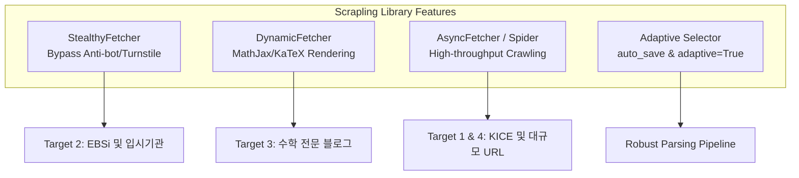
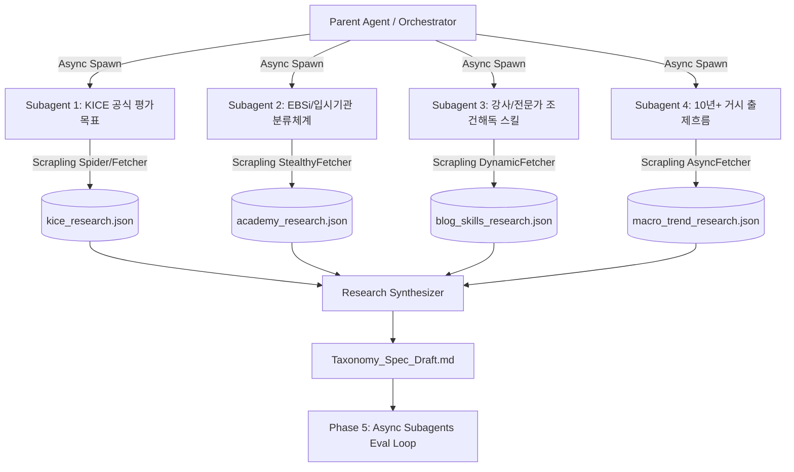
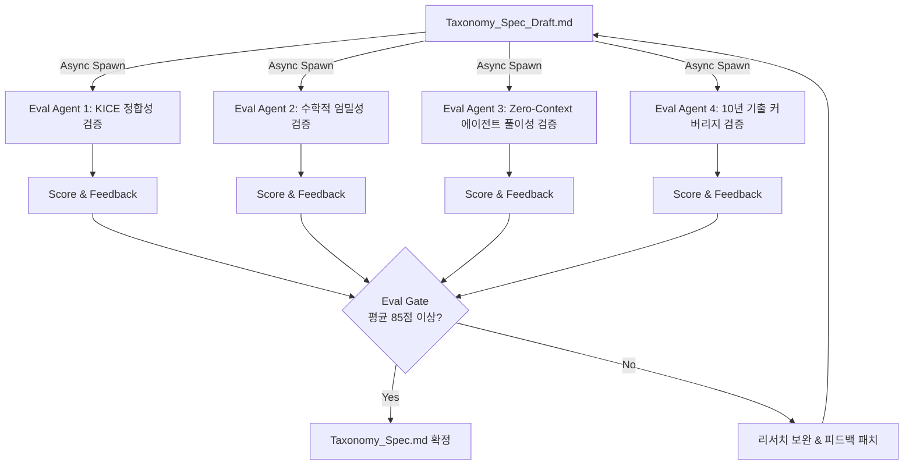

# Step 1: Async Subagents 다각도 Scrapling 리서치 세부 실행 계획서

본 문서는 평가원/수능 수학 기출문항을 최고 수준으로 구조화하기 위한 **Async Subagents 기반 다각도 웹 리서치 실행, Scrapling 기능 활용, 및 결과물 다각도 Eval(평가) 계획서**입니다.

---

## 1. Scrapling (`scrapling/`) 핵심 기능 활용 기술 계획 (Scrapling Feature Mapping)

`c:\Users\packr\Claude\scrapling` 저장소의 고유 기능들을 4대 리서치 타겟별 특성에 맞게 1:1로 매핑하여 최적의 수집 성능과 데이터 안정성을 확보합니다.



### 1.1 Fetcher 모듈별 1:1 타겟 매핑
1. **`StealthyFetcher` (안티봇/보안 우회 수집)**
   - **적용 대상**: EBSi, 메가스터디, 대성학원, 이투스 등 캡차/Turnstile/보안 솔루션이 적용된 사이트
   - **기술 적용**: `StealthyFetcher.fetch(url, headless=True, network_idle=True)`를 구동하여 브라우저 핑거프린팅 탐지를 우회하고 안전하게 해설/정답률 HTML 수집
2. **`DynamicFetcher` (동적 JavaScript & 수식 렌더링 수집)**
   - **적용 대상**: 네이버/티스토리 등 MathJax 또는 KaTeX로 수식이 동적 렌더링되는 수학 전문가 블로그
   - **기술 적용**: `DynamicFetcher`로 JS 실행 완료 후 렌더링된 DOM 요소 및 MathJax 수식 텍스트 추출
3. **`AsyncFetcher` & `Spider` (비동기 대규모 크롤링)**
   - **적용 대상**: KICE 보도자료 archive 및 10년치 기출문항 관련 대량 URL 파이프라인
   - **기술 적용**: `scrapling.spiders.Spider` 기반 병렬 비동기 세션으로 대량 페이지 동시 파싱 및 자동 재시도
4. **`Adaptive Selector` (웹사이트 구조 변경 자율 대응)**
   - **적용 대상**: 전체 수집 파이프라인의 CSS/XPath 셀렉터
   - **기술 적용**: `p.css('.solution-content', auto_save=True)`로 선택자 구조 학습. 사이트 개편 시 `adaptive=True` 파라미터로 요소 자동 재탐색(Element Relocator)

---

## 2. Async Subagents 다각도 리서치 아키텍처 (Multi-Angle Research Architecture)

4개의 전문 Async Subagent를 동시에 구동하여 각기 다른 관점(KICE 공식 지침, 입시기관 해설, 강사/전문가 실전 조건 해석, 10년 거시 트렌드)에서 데이터를 수집·분석합니다.



---

## 3. 4대 Async Subagent 역할 및 프롬프트 명세 (Research Prompts)

### 🤖 Subagent 1: KICE 평가원 공식 평가목표 및 성취기준 연구원
- **Scrapling 기술**: `scrapling.fetchers.Fetcher` 및 `AsyncFetcher`
- **역할**: 한국교육과정평가원(KICE) 보도자료, 수학 영역 출제 매뉴얼, 2015/2022 개정 교육과정 성취기준 문서 분석
- **실행 프롬프트 (Prompt Spec)**:
  ```markdown
  [Subagent 1 System Prompt]
  당신은 한국교육과정평가원(KICE) 수능 수학 출제 가이드라인 전문 연구원입니다.
  c:\Users\packr\Claude\scrapling 의 Fetcher 및 Scrapling 파이프라인을 활용하여 다음을 조사하고 구조화하세요:
  1. KICE 공식 평가목표 (계산, 이해, 추론, 문제해결 능력)의 세부 정의
  2. 2015 및 2022 개정 교육과정 수학(수학I, 수학II, 미적분)의 핵심 성취기준 연계성
  3. 평가원이 밝히는 문항 출제 시 유의사항 및 지문 조건 구성 법칙
  결과는 `../pipeline/research_data/raw/kice_research.json` 포맷에 맞추어 작성하세요.
  ```

### 🤖 Subagent 2: EBSi 및 대형 입시기관 문항 분류체계 연구원
- **Scrapling 기술**: `scrapling.fetchers.StealthyFetcher` (안티봇 우회)
- **역할**: EBSi, 메가스터디, 대성학원, 이투스 등의 2021~2026학년도 수능/평가원 해설지 및 분석 리포트 분석
- **실행 프롬프트 (Prompt Spec)**:
  ```markdown
  [Subagent 2 System Prompt]
  당신은 대형 입시기관의 수능 수학 문항 분석 프레임워크 연구원입니다.
  c:\Users\packr\Claude\scrapling 의 StealthyFetcher를 활용하여 EBSi 및 입시기관(메가/대성 등)의 기출문항 분류체계를 수집하세요:
  1. EBSi/입시기관이 사용하는 문항 태깅 시스템 (단원, 난이도, 킬러/준킬러, 정답률, 대표 유형)
  2. 주요 고난도 문항(21번, 22번, 29번, 30번)의 오답률 및 오답 원인 유형 분류법
  3. 입시기관 해설지에서 공통적으로 사용하는 문항 해설 단계 (도입-전개-결론)
  결과는 `../pipeline/research_data/raw/academy_research.json` 포맷에 맞추어 작성하세요.
  ```

### 🤖 Subagent 3: 강사/전문가 실전 조건해독 및 풀이 스킬 연구원
- **Scrapling 기술**: `scrapling.fetchers.DynamicFetcher` (MathJax/JS 수식 렌더링)
- **역할**: 수학 전문 블로그, 일타강사 교재/해설 분석을 통한 조건(가/나/다) 해석 패턴 및 실전 스킬 수집
- **실행 프롬프트 (Prompt Spec)**:
  ```markdown
  [Subagent 3 System Prompt]
  당신은 수능 수학 실전 풀이 스킬 및 조건 해독(Condition Parsing) 전문 연구원입니다.
  c:\Users\packr\Claude\scrapling 의 DynamicFetcher를 사용하여 네이버/티스토리/전문가 블로그의 수학 기출 조건 해석글을 리서치하세요:
  1. 지문 조건(예: "모든 실수 x에 대하여...", "f(x)가 미분가능하고...", "절댓값 함수의 미분가능성")이 뜻하는 직관적 수학 조건 변환 공식
  2. 실전 수능에서 자주 사용되는 연산 단축 스킬 (비율 관계, 대칭성, 넓이 공식, 삼차/사차함수 그래프 개형 특수성)
  3. 학생들이 자주 범하는 오개념 및 계산 함정 유도 패턴 (Distractor)
  결과는 `../pipeline/research_data/raw/blog_skills_research.json` 포맷에 맞추어 작성하세요.
  ```

### 🤖 Subagent 4: 10년+ 평가원 거시 출제흐름 및 계통도 연구원
- **Scrapling 기술**: `scrapling.spiders.Spider` 및 `AsyncFetcher`
- **역할**: 2015~2026학년도 최근 10년+ 기출문항의 거시적 출제 흐름, 조건 변천사, 신유형 진화 패턴 분석
- **실행 프롬프트 (Prompt Spec)**:
  ```markdown
  [Subagent 4 System Prompt]
  당신은 수능 수학 10년 거시 트렌드 및 기출 계통도 전문 연구원입니다.
  c:\Users\packr\Claude\scrapling 의 Spider 엔진을 활용하여 최근 10년 간(2015~2026학년도) 평가원/수능 수학 출제 흐름을 조사하세요:
  1. 연도별 킬러/준킬러 문항의 주제 이동 (예: 미분 종합 ➔ 합성함수 ➔ 함수 추론 및 정수/자연수 조건 변별력)
  2. 동일한 수학적 아이디어가 연도별로 어떻게 진화하고 변형되었는지 (기출 계통도)
  3. 2022 개정 교육과정 도입에 따른 2027학년도 6월 평가원 예상 출제 메커니즘
  결과는 `../pipeline/research_data/raw/macro_trend_research.json` 포맷에 맞추어 작성하세요.
  ```

---

## 4. 리서치 결과 저장 및 구조화 저장소 설계 (Data Storage Schema)

```
Claude/
└── ../pipeline/
    ├── research_spiders/               # Scrapling 기반 스파이더/수집 모듈
    │   ├── kice_fetcher.py
    │   ├── academy_stealth.py
    │   ├── blog_dynamic.py
    │   └── macro_spider.py
    └── research_data/
        ├── raw/                        # Subagents 수집 원범 JSON
        │   ├── kice_research.json
        │   ├── academy_research.json
        │   ├── blog_skills_research.json
        │   └── macro_trend_research.json
        ├── structured/                 # 축별 정규화 결과 저장소
        ├── eval/                       # Phase 5 Eval 결과 저장소
        │   ├── eval_report.json        # 4개 Eval 에이전트 평가 결과
        │   └── eval_scores.md          # 항목별 평가 점수표
        └── taxonomy_spec.md            # Eval 통과 최종 분석 축 명세서
```

---

## 5. Async Subagents 기반 다각도 결과물 평가 및 교차 검증 (Eval Protocol)

리서치 결과물(`Taxonomy_Spec_Draft.md` 및 정규화 데이터)이 완성되면, **4개의 독립된 Eval Async Subagent**를 구동하여 다각도로 질적 평가 및 교차 검증(Cross-Validation)을 수행합니다.



### 5.1 4대 Eval Async Subagent 역할 및 평가 루브릭 (Eval Rubric)

#### 🧪 Eval Agent 1: KICE 교육과정 정합성 평가원 (`Eval_KICE_Alignment`)
- **평가 기준**: 리서치된 분석 축이 2015/2022 개정 교육과정 성취기준 및 KICE 평가목표(이해/추론/문제해결)와 일치하는가?
- **루브릭**:
  - Educational Alignment Score (0~100점)
  - 교육과정 위계 위반 및 용어 오류 검출

#### 🧪 Eval Agent 2: 수학적 엄밀성 및 조건 수식 완전성 평가원 (`Eval_Math_Rigor`)
- **평가 기준**: 조건 해독(Condition Parsing) 수식, LaTeX 표현, 실전 스킬(비율관계 등)이 수학적으로 오류 없이 엄밀한가?
- **루브릭**:
  - Mathematical Correctness Score (0~100점)
  - 조건 변환 시 오류/생략된 전제 조건(예: 미분가능성, 연속성 조건) 검출

#### 🧪 Eval Agent 3: Zero-Context Agent 수용성 및 풀이 검증원 (`Eval_Agent_Solvability`)
- **평가 기준**: 사전 맥락이 없는 Zero-Context LLM Agent가 이 도출된 스키마(Taxonomy)만으로 실제 고난도 기출(예: 2024학년도 수능 미적분 22번, 30번)을 왜곡/오류 없이 완벽히 해석하고 풀어낼 수 있는가?
- **루브릭**:
  - Zero-Context Agent Reasoning Success Rate (Pass/Fail)
  - 에이전트 프롬프트 환각(Hallucination) 유발 요소 검출

#### 🧪 Eval Agent 4: 10년+ 기출 커버리지 및 트렌드 일관성 평가원 (`Eval_Historical_Coverage`)
- **평가 기준**: 2015~2026학년도 기출 킬러/준킬러 문항 중 도출된 분석 축으로 분류되지 않는 예외 문항이 존재하는가?
- **루브릭**:
  - 10-Year Item Coverage Ratio (%) (목표: 98% 이상)
  - 미분류 누락 기출 패턴 검출

### 5.2 Eval Gate 및 자동 피드백 루프 (Feedback Loop)
- 4개 Eval 에이전트의 종합 평가 결과를 `../pipeline/research_data/eval/eval_report.json`에 저장.
- **Eval Gate 통과 기준**: 4개 평가 항목 종합 평균 85점 이상 & Zero-Context Solvability Pass.
- 통과 시 `Taxonomy_Spec.md` 최종 확정. 기준 미달 시 지적된 피드백 반영 후 리서치 재보완.
