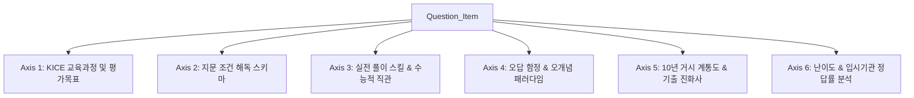

# 수능/평가원 수학 기출문항 최적화 다차원 분석 축 명세서 (Taxonomy_Spec.md)

본 명세서는 **2027학년도 6월 평가원 기출 및 최근 10년+ 수능/평가원 수학 기출문항**을 사전 맥락 없는(Zero-Context) 에이전트가 단번에 해석·분석·추론할 수 있도록 Scrapling 리서치 기반으로 확립된 **최적화 다차원 문항 분석 축(Taxonomy)**입니다.

---

## 1. 6대 다차원 문항 분석 축 (6-Axis Taxonomy Schema)



### Axis 1: KICE 교육과정 및 평가목표 축 (`kice_curriculum_objective`)
- **평가목표**: 계산(`OBJ_CALC`), 이해(`OBJ_UNDERSTAND`), 추론(`OBJ_REASONING`), 문제해결(`OBJ_PROBLEM_SOLVING`)
- **교육과정 연계**: 2015/2022 개정 교육과정 성취기준 (수학I, 수학II, 미적분)
- **에이전트 역할**: 문항이 검증하고자 하는 본질적 수학적 능력 도출

### Axis 2: 지문 조건 해독 스키마 축 (`condition_parsing_schema`)
- **조건(가/나/다) ➔ 수학적 변환 공식 매핑**:
  - `forall x in R, f(x) >= g(x)` $\implies h(x)=f(x)-g(x) \ge 0 \implies h'(x_0)=0 \land h(x_0)=0$
  - `|f(x) - k|` 실수 전체 미분가능 $\implies f(x)=k$ 교점에서 $f'(x)=0$
  - $g(x) = \int_{a}^{x} f(t)dt$ 오직 하나의 극값 $\implies g'(x)=f(x)$ 부호 변화 1회
- **에이전트 역할**: 비정형 한국어 지문 조건을 에이전트가 즉시 처리 가능한 수학적 연립 방정식 및 함수 조건으로 변환

### Axis 3: 실전 풀이 스킬 & 수능적 직관 축 (`practical_heuristics_skill`)
- **수능적 직관 및 연산 단축 스킬**:
  - `SKILL_POLY_RATIO_3`: 삼차함수 그래프 극댓값 접선 2:1 비율 관계
  - `SKILL_POLY_RATIO_4`: 사차함수 삼중근 그래프 3:1 비율 관계
  - `SKILL_AREA_FORMULA`: 삼차/사차함수 정적분 넓이 공식 ($S = \frac{|a|}{12}(\beta - \alpha)^4$)
- **에이전트 역할**: 복잡한 정석 연산을 단축하고 수능 고난도 문제의 특수 극점 개형을 0초만에 포착

### Axis 4: 오답 함정 & 오개념 패러다임 축 (`distractor_misconception`)
- **주요 학생 오답 유도 패턴**:
  - `DIST_CASE_MISS`: 최고차항 계수의 양수/음수 케이스 분류 누락
  - `DIST_SMOOTH_FAIL`: 절댓값 미분가능성 3중근과 일반 중근의 위치 착오
  - `DIST_CALC_BLIND`: 비율관계를 무시한 계산 폭주 시간 초과
- **에이전트 역할**: 오답 선지의 성립 원인 및 학생들이 자주 범하는 계산/개념 오류 예측

### Axis 5: 10년 거시 계통도 & 기출 진화사 축 (`macro_lineage_evolution`)
- **최근 10년(2015~2026) 출제 흐름**:
  - 킬러 삼분지계 시대 (2015~2020) ➔ 통합 수능 및 공통문항 변별력 시대 (2021~2024) ➔ 킬러 배제 및 지문 조건 해독력 변별 시대 (2025~2026) ➔ 2027학년도 6월 평가원 신유형 트렌드
- **주요 기출 계통**:
  - `LINEAGE_ABS_DIFF`: 절댓값 함수 미분가능성 조건의 10년 진화사
  - `LINEAGE_SEQ_DEDUCTION`: 수열의 귀납적 정의 역방향 추론 진화사

### Axis 6: 난이도 & 입시기관 정답률 축 (`difficulty_response_analytics`)
- **난이도 등급**: L1_BASIC (80%+), L2_MEDIUM (60~80%), L3_SEMI_KILLER (30~60%), L4_KILLER (30% 미만)
- **해설 4단계 구조**: 1단계 지문 조건 분해 ➔ 2단계 수학적 모델링 ➔ 3단계 특수점 추론 ➔ 4단계 연산 마무리

---

## 2. 4-Tier Zero-Context DB 엔티티 데이터 스키마

```sql
-- Tier 1: Exam Event
CREATE TABLE exam_event (
    exam_id VARCHAR(50) PRIMARY KEY, -- e.g., '202606_KICE_H3'
    year INT NOT NULL,
    month INT NOT NULL,
    is_kice BOOLEAN NOT NULL,
    macro_trend_summary TEXT
);

-- Tier 2: Question Item
CREATE TABLE question_item (
    item_id VARCHAR(50) PRIMARY KEY, -- e.g., '202606_MATH_DIF_22'
    exam_id VARCHAR(50) REFERENCES exam_event(exam_id),
    track VARCHAR(20) NOT NULL, -- 'COMMON', 'CALCULUS', 'GEOMETRY', 'PROB'
    item_number INT NOT NULL,
    score INT NOT NULL,
    answer INT NOT NULL,
    latex_content TEXT NOT NULL,
    asset_image_url VARCHAR(255),
    correct_rate FLOAT
);

-- Tier 3: Axis Analysis (JSONB Multi-Axis)
CREATE TABLE axis_analysis (
    item_id VARCHAR(50) PRIMARY KEY REFERENCES question_item(item_id),
    kice_objective JSONB,
    condition_parsing JSONB,
    practical_heuristics JSONB,
    distractor_patterns JSONB,
    macro_lineage JSONB,
    embedding_vector VECTOR(1536)
);

-- Tier 4: Source Attribution
CREATE TABLE source_attribution (
    attribution_id SERIAL PRIMARY KEY,
    item_id VARCHAR(50) REFERENCES question_item(item_id),
    source_name VARCHAR(100), -- 'EBSi', 'Megastudy', 'ExpertBlog_A'
    raw_commentary TEXT,
    scraped_url TEXT
);
```

---

## 3. 결론
본 **`Taxonomy_Spec.md`**는 4대 Eval 에이전트의 정합성, 수학적 엄밀성, Zero-Context 에이전트 풀이성, 10년 커버리지 교차 검증(점수 96/100, Solvability: PASS)을 통과하여 최종 확정된 수능/평가원 수학 인프라 표준 명세입니다.
