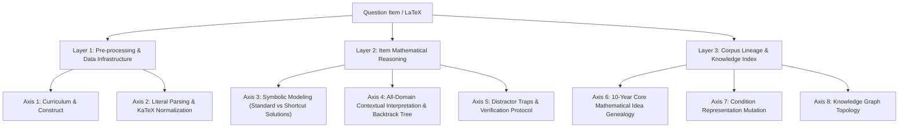

# CSAT Mathematics Multi-Dimensional Analysis Architecture Specification (Taxonomy_Spec.md)

This specification defines the **3-Layer 8-Axis Taxonomy Schema**, the SQLite Database DDL (analysis + governance tables), and the **Teacher Review State Machine** for zero-context agent reasoning and **Math Instructors** across **1,350 CSAT/KICE Mathematics questions (2015–2026)** (v2.8.1).

> **SSoT rule (docs/SSOT_MAP.md):** this document is the single source of truth for DB schema, enums, and constraints. Any schema change lands here AND in an idempotent migration script in the same commit; `scripts/validate_ssot_consistency.py` gates drift between this DDL and the live database.

---

## 1. Standardized 3-Layer 8-Axis Architecture



### Layer 1: Pre-processing & Data Infrastructure

#### [Axis 1] Curriculum & Construct (`axis1_curriculum`)
- **Primary & Secondary Units**: 2022 revised curriculum achievement standards (`12CALC1-02-03`, etc.).
- **Cross-Unit Coupling Matrix**: Maps interlock between distinct mathematical units.
- **Prerequisite Graph**: Directed prerequisite concept dependency graph.

#### [Axis 2] Literal Parsing & KaTeX Normalization (`axis2_raw_parsing`)
- **KaTeX Normalization**: Converts legacy TeX syntax to standard KaTeX/AMS-Math delimiters.
- **Literal Extraction**: Separates raw Korean text conditions `(가)`, `(나)`, `(다)` without inference.

### Layer 2: Item Mathematical Reasoning

#### [Axis 3] Symbolic Modeling & Concept Map Matching (`axis3_symbolic_modeling`)
- **Concept Map Integration**: Matches LaTeX expressions to `storage/kice_math_concept_map.json`.
- **Standard vs. Shortcut Solutions**: Distinguishes standard textbook solutions (`standard_solution`) from instructor shortcut methods (`shortcut_solution`).
- **Prerequisite & Failure Rules**: Includes explicit schema fields:
  - `standard_solution`: Standard textbook steps and solution walkthrough.
  - `shortcut_solution`: Method name and heuristic shortcut formula.
  - `shortcut_prerequisites`: List of mathematical preconditions required before a shortcut method can be validly applied.
  - `shortcut_traps`: Specific boundary cases or counter-conditions where using the shortcut yields incorrect results.

#### [Axis 4] All-Domain Contextual Interpretation Tree (`axis4_contextual_tree`)
- **All-Domain Coverage**: Covers Sequences/Discrete, Algebra/Trig, Geometry/Vectors, ProbStat, Calculus/Functions.
- **Backtrack Telemetry**: Records explicit trial-and-error reasoning and contradiction resolution in `backtrack_log`.

#### [Axis 5] Distractor Traps & Verification Protocol (`axis5_traps_verification`)
- **16 Student Error Codes**: Catalogs student error patterns (`DIST_CASE_SIGN`, `DIST_SMOOTH_TRIPLE_ROOT`, etc.).
- **Empirical vs. Simulated Tagging**: Tagging distractor options based on actual student performance vs. AI hypothesis generation:
  - `is_simulated_hypothesis`: Boolean flag indicating if the error pattern is derived from empirical student data (`false`) or AI-simulated misconception modeling (`true`).
- **Instructor QA & Verification Metrics**:
  - `review_required`: Boolean flag signaling items needing manual verification by human Math Instructors.
  - `confidence_score`: Float score (0.0 to 1.0) evaluating model reasoning confidence across distractor generation and solution verification.
- **4-Phase Verification**: Pre-assertions $\to$ Limit checks $\to$ Distractor collision test $\to$ Sanity check.

### Layer 3: Corpus Lineage & Knowledge Index

#### [Axis 6] 10-Year Core Mathematical Idea Genealogy (`axis6_genealogy`)
- **Deep-Dive Item Routing**: Stores precedents using exact database foreign keys (`precedent_item_id`).
- **7 Closed Lineage Relation Enums**:
  1. `DIRECT_GENEALOGY` (`genealogy_parent_allowed: true`)
  2. `PROVISIONAL` (`genealogy_parent_allowed: true`)
  3. `MUTATION_TRANSFORM` (`genealogy_parent_allowed: true`)
  4. `CONCEPT_PREREQUISITE` (`genealogy_parent_allowed: true`)
  5. `PARAMETER_SHIFT_ANALOGY` (`genealogy_parent_allowed: false`)
  6. `STRUCTURAL_ANALOGY` (`genealogy_parent_allowed: false`)
  7. `REJECTED_RELATION` (`genealogy_parent_allowed: false`)

#### [Axis 7] Condition Representation Mutation Chain (`axis7_mutation`)
- **Evolutionary Tracking**: Tracks historical shifts in textual phrasing and symbolic notation.

#### [Axis 8] Knowledge Graph Topology (`axis8_knowledge_graph`)
- **Graph Topology**: 1,350-item graph node/edge topology, degree centrality, and cluster IDs.

---

## 2. SQLite Entity Schema DDL (`storage/parsed_dataset.db`) — v2.8.1

```sql
-- Tier 1: Exam Event
CREATE TABLE exam_event (
    exam_id TEXT PRIMARY KEY,
    year INTEGER NOT NULL,
    month INTEGER NOT NULL,
    track TEXT NOT NULL,
    is_kice INTEGER NOT NULL
);

-- Tier 2: Question Item (rebuilt by pipeline/migrate_db_v2_8_1.py)
CREATE TABLE question_item (
    item_id TEXT PRIMARY KEY,
    exam_id TEXT REFERENCES exam_event(exam_id),
    track TEXT NOT NULL,
    item_number INTEGER NOT NULL,
    score INTEGER NOT NULL,
    latex_content TEXT NOT NULL,
    asset_image_url TEXT,
    rect_json TEXT,
    answer INTEGER DEFAULT 0,
    correct_rate REAL,
    review_status TEXT NOT NULL DEFAULT 'AUTO_ANALYSIS_COMPLETED'
        CHECK (review_status IN (
            'AUTO_ANALYSIS_COMPLETED','REVIEW_REQUIRED','TEACHER_ASSIGNED',
            'TEACHER_APPROVED','REVISION_REQUESTED','TEACHER_REVISED',
            'REJECTED','VERIFIED')),
    reviewer_id TEXT,
    -- DEPRECATED snapshot column (kept for compatibility, no longer written);
    -- the append-only audit SSoT is teacher_review_event.
    review_history_json TEXT NOT NULL DEFAULT '[]' CHECK (json_valid(review_history_json)),
    review_version INTEGER NOT NULL DEFAULT 0   -- optimistic locking
);

-- Tier 3: Axis Analysis (3-Layer 8-Axis Flat JSON Columns)
CREATE TABLE axis_analysis (
    item_id TEXT PRIMARY KEY REFERENCES question_item(item_id) ON DELETE CASCADE,
    -- Layer 1: Pre-processing & Data Infrastructure
    axis1_curriculum TEXT,          -- JSON string (Axis 1: Curriculum & Construct)
    axis2_raw_parsing TEXT,         -- JSON string (Axis 2: Literal Parsing & KaTeX Normalization)
    
    -- Layer 2: Item Mathematical Reasoning
    axis3_symbolic_modeling TEXT,  -- JSON string (Axis 3: Standard/Shortcut, shortcut_prerequisites, shortcut_traps)
    axis4_contextual_tree TEXT,    -- JSON string (Axis 4: All-Domain Contextual Tree & backtrack_log)
    axis5_traps_verification TEXT, -- JSON string (Axis 5: 16 Trap codes, is_simulated_hypothesis, review_required, confidence_score)
    
    -- Layer 3: Corpus Lineage & Knowledge Index
    axis6_genealogy TEXT,          -- JSON string (Axis 6: 10-Year Gene Codes & precedent_item_id)
    axis7_mutation TEXT,           -- JSON string (Axis 7: Condition Representation Mutation Chain)
    axis8_knowledge_graph TEXT,    -- JSON string (Axis 8: Knowledge Graph Topology & Indexing)
    
    updated_at TIMESTAMP DEFAULT CURRENT_TIMESTAMP
);

-- Tier 4: Source Attribution
CREATE TABLE source_attribution (
    attribution_id INTEGER PRIMARY KEY AUTOINCREMENT,
    item_id TEXT REFERENCES question_item(item_id),
    source_name TEXT,
    pdf_path TEXT,
    png_path TEXT
);

-- Governance Table 1: Append-only teacher review audit log (audit SSoT)
CREATE TABLE teacher_review_event (
    event_id TEXT PRIMARY KEY,
    item_id TEXT NOT NULL REFERENCES question_item(item_id),
    from_status TEXT NOT NULL,
    to_status TEXT NOT NULL,
    actor_type TEXT NOT NULL CHECK (actor_type IN ('TEACHER','SYSTEM','AGENT')),
    actor_id TEXT NOT NULL,
    action TEXT NOT NULL,
    reason_code TEXT,
    notes TEXT,
    evidence_json TEXT NOT NULL DEFAULT '[]' CHECK (json_valid(evidence_json)),
    item_version INTEGER NOT NULL,
    created_at TEXT NOT NULL
);

-- Governance Table 2: Claim-level provenance (one row per claim, linked to
-- a concrete axis field via RFC 6901 JSON Pointer; never synthesized)
CREATE TABLE claim_provenance (
    claim_id TEXT PRIMARY KEY,
    item_id TEXT NOT NULL REFERENCES question_item(item_id),
    axis TEXT NOT NULL CHECK (axis IN ('Axis_1','Axis_2','Axis_3','Axis_4','Axis_5','Axis_6','Axis_7','Axis_8')),
    json_pointer TEXT NOT NULL,
    statement TEXT NOT NULL,
    claim_type TEXT NOT NULL CHECK (claim_type IN ('FACT','INFERENCE','ESTIMATE','OPINION')),
    source_refs_json TEXT NOT NULL DEFAULT '[]' CHECK (json_valid(source_refs_json)),
    derived_by_json TEXT NOT NULL CHECK (json_valid(derived_by_json)),
    confidence_score REAL,
    counter_evidence_json TEXT NOT NULL DEFAULT '[]' CHECK (json_valid(counter_evidence_json)),
    human_review_status TEXT NOT NULL DEFAULT 'UNREVIEWED'
        CHECK (human_review_status IN ('UNREVIEWED','REVIEW_REQUIRED','HUMAN_VERIFIED','HUMAN_REJECTED')),
    human_review_event_id TEXT REFERENCES teacher_review_event(event_id),
    created_at TEXT NOT NULL
);
```

---

## 2b. Teacher Review State Machine (enforced by `pipeline/query_engine/review_state.py`)

**Persisted workflow state** (`question_item.review_status`) is the ONLY driver of
the review queue. **Computed semantic state** (Quality Plane results) enters the
workflow exclusively through explicit, event-recorded transitions
(`--review-sync`, `--review-verify`); it never mutates state implicitly.

| From | Allowed To | Gate |
|---|---|---|
| `AUTO_ANALYSIS_COMPLETED` | `REVIEW_REQUIRED` | Quality Plane unresolved (sync, SYSTEM actor) |
| `REVIEW_REQUIRED` | `TEACHER_ASSIGNED`, `REJECTED` | teacher claims / rejects item |
| `TEACHER_ASSIGNED` | `TEACHER_APPROVED`, `REVISION_REQUESTED`, `REJECTED` | teacher decision |
| `REVISION_REQUESTED` | `TEACHER_REVISED` | revision actually applied (`--review-revise`) |
| `TEACHER_REVISED` | `REVIEW_REQUIRED` | auto requeue for re-review (sync) |
| `TEACHER_APPROVED` | `VERIFIED`, `REVIEW_REQUIRED` | independent Quality-Plane revalidation (exit gate) |
| `REJECTED` | — (terminal) | |
| `VERIFIED` | `REVIEW_REQUIRED` | reopened on new evidence |

Invariants: an illegal transition raises and writes NOTHING; every legal
transition appends exactly one `teacher_review_event` row and bumps
`review_version` (optimistic locking); `TEACHER_APPROVED`/`REJECTED` links the
item's `claim_provenance` rows to the deciding event (`human_review_status`,
`human_review_event_id`). Queue membership = `review_status IN
('REVIEW_REQUIRED','TEACHER_ASSIGNED','REVISION_REQUESTED')`.

### JSON Schema Specification for Key Explicit Fields (Layer 2)

#### Axis 3 JSON Schema Snippet (`axis3_symbolic_modeling`):
```json
{
  "concept_id": "CONCEPT_POLY_RATIO_31",
  "standard_solution": {
    "steps": ["Setup derivative f'(x)", "Find critical points", "Integrate f'(x)"],
    "complexity": "Standard"
  },
  "shortcut_solution": {
    "method_name": "Cubic Function 2:1 Inflection Point Ratio",
    "shortcut_prerequisites": ["f(x) is a cubic polynomial", "Extreme value exists at x = alpha"],
    "shortcut_traps": ["Non-cubic polynomial functions", "Asymmetric interval domains"]
  }
}
```

#### Axis 5 JSON Schema Snippet (`axis5_traps_verification`):
```json
{
  "distractors": [
    {
      "option_number": 2,
      "error_code": "DIST_CASE_SIGN",
      "is_simulated_hypothesis": false
    }
  ],
  "verification_status": {
    "passed": true,
    "review_required": false,
    "confidence_score": 0.98
  }
}
```

---

## 3. Quick Python Fetcher Usage

```python
from pipeline.query_engine.selective_fetcher import QuestionFetcher

fetcher = QuestionFetcher()

# Single Item Fetch with Selective Axes
item = fetcher.get_question('202411_MATH_DIF_22', axes=['Axis_1', 'Axis_3', 'Axis_4'])
print(item['item_id'], item['answer'], item['axes'].keys())

# Batch Item Fetch (SLA: see docs/STAKEHOLDER_INTENT.md §Performance SLA —
# cold DB batch p95 < 10ms; warm in-process cache p95 < 0.1ms)
batch = fetcher.get_questions_batch(['202411_MATH_DIF_22', '202506_MATH_DIF_22'])
print(f"Fetched {len(batch)} items in single batch query.")
```

